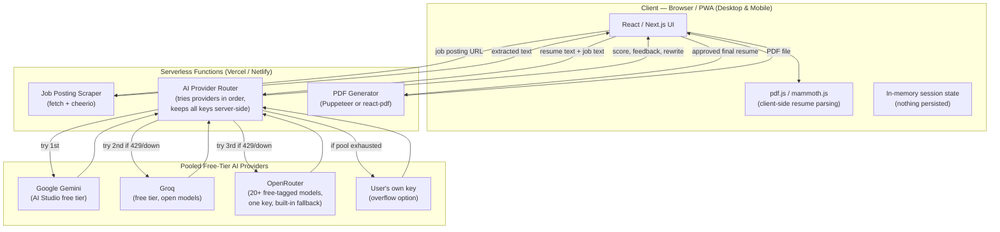
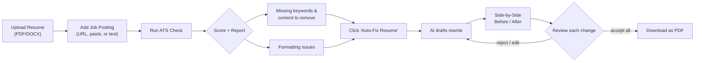
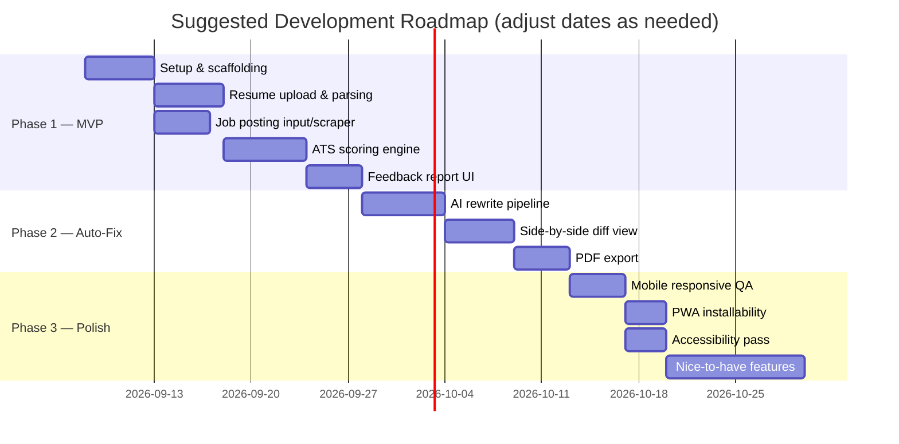

# Resume ATS Checker & Auto-Fixer — Project Plan

A free, open-source web app where a user uploads their resume and a job posting, gets an ATS
(Applicant Tracking System) compatibility score with specific feedback, and can auto-generate a
fixed version of their resume with a before/after side-by-side comparison and PDF download.

Works on desktop and mobile as a single responsive web app (PWA).

---

## 1. Key Design Assumptions

These are the calls I made to turn an open-ended idea into a buildable plan. Change any of them
before you start if they don't fit what you want:

| Decision | Choice | Why |
|---|---|---|
| Platform | One responsive **Progressive Web App (PWA)**, not native iOS/Android apps | Same codebase covers PC + mobile; installable; zero app-store cost or review process |
| Data persistence | **Nothing stored server-side by default** — resume is processed in-session and forgotten after download | Free (no database needed), and it sidesteps a lot of privacy/legal overhead of storing people's resumes |
| AI cost model | **Pooled free-tier keys** (Gemini, Groq, OpenRouter's free models) that you supply, with BYOK as an overflow option (see §10) | Zero-cost API usage for you as long as usage stays inside the free quotas; BYOK is the release valve when it doesn't |
| Resume truthfulness | AI **rewrites and reorganizes only what's true** — it never invents jobs, dates, degrees, or skills | Non-negotiable guardrail — an AI-fabricated resume is a serious real-world harm to the user |

---

## 2. Feature Set

### Core (MVP — build this first)

- **Resume upload**: PDF and DOCX, drag-and-drop or file picker, plus a mobile-friendly tap-to-upload.
- **Job posting input**: paste a URL (server scrapes it), paste the raw text, or paste a plain description — all three, since scraping fails on many sites (logins, JS-rendered pages, anti-bot blocks).
- **ATS Parseability Check** — simulate what an ATS actually sees:
  - Flags tables, multi-column layouts, text boxes, images/icons, headers/footers, and non-standard fonts (all things real ATS parsers mangle or drop).
  - Shows the user a "plain text extraction preview" so they can see exactly what a bot would read.
- **Keyword / Relevance Match**:
  - Extracts required hard skills, tools, certifications, and soft skills from the job posting.
  - Compares against the resume (including reasonable synonym matching, e.g. "JS" ↔ "JavaScript").
- **Score + Feedback Report**:
  - Overall score (0–100) with a breakdown (see §5 for the formula).
  - What's **missing** (keywords, sections, quantified results).
  - What should be **removed or trimmed** (irrelevant older roles, filler phrases like "team player," overlong bullets, redundant skills).
  - Formatting issues to fix.
- **Auto-Fix**:
  - One click generates a rewritten resume: tightened bullets, weak phrasing replaced, missing-but-true keywords woven in naturally, better section order.
  - Never adds a skill, job, or credential the user didn't already have — at most it *suggests* ones they should add themselves if true.
- **Before/After Side-by-Side View**:
  - Two-column diff on desktop; tabbed "Before / After" swipe view on mobile (screens too narrow for two columns).
  - Additions highlighted, removals struck through.
  - User can accept, reject, or manually edit any individual change before finalizing.
- **Download**: export the final resume as a **PDF** (DOCX export is an easy add-on, see §2's stretch list).

### Stretch / v2 ideas

- Cover letter generator from the same resume + job posting.
- Save multiple tailored versions per job application, with a simple application tracker (applied / interview / offer / rejected).
- Grammar and tone pass (the open-source LanguageTool API is free/self-hostable).
- ATS-safe resume templates to start from.
- "Which job fits this resume best?" — score one resume against several saved postings.
- Score history so a user can see improvement over time.
- Browser extension to grab the job posting straight from LinkedIn/Indeed while browsing.

### Extra features I'd genuinely recommend adding

- **Explain-the-score tooltips** — every point lost should say exactly why, not just "-5 formatting." Vague scores erode trust in the whole tool.
- **Manual review mode** for the auto-fix: change-by-change accept/reject (already listed above) rather than all-or-nothing — this is what makes the "fix" trustworthy instead of a black box.
- **Rate limiting** on the scrape and AI endpoints regardless of which cost model you pick (§10) — without it, a single bad actor can rack up your API bill or get your scraper IP-banned.
- **Accessibility pass on the tool itself** — keyboard navigation and screen-reader labels, especially important since job seekers are the audience and some are using assistive tech.

---

## 3. Architecture



**Why a backend at all, if nothing's stored?** Two things can't happen purely in the browser:
scraping an arbitrary URL (blocked by CORS) and calling the AI API without exposing your secret
key to every visitor. Everything else — PDF/DOCX parsing, the diff view — happens client-side.

---

## 4. User Flow



---

## 5. ATS Scoring Methodology

A transparent, explainable formula beats a mysterious single number:

| Category | Points | What it checks |
|---|---|---|
| Keyword match | 40 | % of the job posting's required hard skills, tools, and certifications found in the resume (with synonym matching) |
| Formatting / parseability | 30 | Penalizes tables, columns, images, text boxes, headers/footers, unusual fonts |
| Content quality | 20 | Quantified achievements, strong action verbs, no first-person pronouns, appropriate length (1–2 pages) |
| Structure | 10 | Standard section headers present, contact info complete, reverse-chronological order |

**Total: /100.** Suggest a plain-language label alongside the number (e.g. 80+ "Likely to pass
most ATS," 60–79 "Needs work," below 60 "High risk of rejection") — and always show *why*, per
category, not just the total.

Be upfront in the UI that this approximates common ATS behavior; every company's actual ATS
software differs, so this is guidance, not a guarantee.

---

## 6. Tech Stack

| Layer | Choice | Notes |
|---|---|---|
| Frontend | Next.js (React) + Tailwind CSS | One responsive PWA covers desktop + mobile |
| Resume parsing | pdf.js (PDF), mammoth.js (DOCX) | Runs client-side — resume never has to leave the browser for parsing |
| Job scraping | cheerio (or Playwright if you need JS-rendered pages) in a serverless function | Needed to get around CORS |
| AI / NLP | Pooled free-tier providers (Gemini, Groq, OpenRouter) behind a router, called from a server function | Keys never exposed to the client; router falls back across providers (see §10) |
| PDF export | react-pdf or Puppeteer (HTML → PDF) | Free, keeps formatting control |
| Storage | None for MVP; Supabase or Firebase free tier if you add accounts/history later | Skipping a DB removes cost and privacy liability up front |
| Hosting | Vercel or Netlify free tier | Handles both the static frontend and the serverless functions |
| CI | GitHub Actions free tier | Lint/test on every PR |

---

## 7. Suggested Repo Structure

```
resume-ats-checker/
├── README.md
├── LICENSE
├── .env.example                    # Documents every required key — no real values
├── .github/
│   └── FUNDING.yml                 # Powers the repo's "Sponsor" button
├── docs/
│   └── RESUME_ATS_CHECKER_PLAN.md
├── public/
├── src/
│   ├── app/
│   │   ├── page.tsx                # Landing / upload page
│   │   ├── report/page.tsx         # Score + feedback report
│   │   ├── editor/page.tsx         # Before/after side-by-side view
│   │   └── api/
│   │       ├── scrape-job/route.ts
│   │       ├── analyze/route.ts
│   │       ├── rewrite/route.ts
│   │       ├── export-pdf/route.ts
│   │       └── donate/route.ts     # Only needed if you build the PayPal SDK option (§11)
│   ├── components/
│   │   ├── UploadDropzone.tsx
│   │   ├── ScoreBreakdown.tsx
│   │   ├── FeedbackList.tsx
│   │   ├── DiffView.tsx
│   │   ├── DownloadButton.tsx
│   │   └── DonateButton.tsx
│   ├── lib/
│   │   ├── parseResume.ts
│   │   ├── scoring.ts
│   │   ├── keywordExtract.ts
│   │   └── aiProviderRouter.ts     # Tries Gemini → Groq → OpenRouter → BYOK, in order
│   └── styles/
├── tests/
└── package.json
```

---

## 8. Privacy & Ethical Guardrails

- **No fabrication, ever.** The rewrite step must only rephrase, reorganize, trim, or surface
  keywords the user's actual content already supports. It can *suggest* "you might add X skill if
  you have it," but it must never insert unverified claims.
  **Hard-won lesson while building this**: a prompt instruction saying "never invent an employer"
  is not sufficient on its own. A free-tier model, given a job posting almost totally unrelated to
  the candidate's real background, fabricated two entire fake jobs — including one at the exact
  company from the job posting — despite that explicit instruction. The working fix was a code-level
  check (not just a prompt tweak): after generation, scan the rewritten resume's employer/company
  lines and reject the output outright if any doesn't trace back to the original resume, falling
  back to the safe mechanical rewrite instead. Treat this as a required component of the Auto-Fix
  feature, not an optional enhancement — see `src/lib/fabricationGuard.ts` in the reference build.
- **State data handling plainly in the UI**: what happens to the resume (processed and discarded,
  or sent to a third-party AI API). With a multi-provider pool (§10), say which providers are in
  rotation (e.g. "Google, Groq, or one of OpenRouter's upstream providers") since the resume text
  may be sent to whichever one happens to serve the request — you can't promise just one name.
- **No dark patterns** around the score — if you ever add a paid tier, don't gate an accurate
  score behind it; that undermines the tool's entire value.

---

## 9. Responsive Design Notes (PC & Mobile)

- Single Next.js PWA using Tailwind breakpoints — no separate mobile codebase.
- Side-by-side diff: two-column CSS grid at ≥768px; below that, a tabbed/swipeable "Before /
  After" view (two columns are unreadable on a phone).
- File upload uses the native file picker so it works identically with mobile "Files" apps and
  desktop drag-and-drop.
- Test on at least: Chrome desktop, Safari desktop, Safari iOS, Chrome Android.

---

## 10. AI Provider Pool & Cost Strategy

### Where the secrets actually live (important correction)

**GitHub Secrets and your live app's runtime secrets are two different things.** GitHub Secrets
(Settings → Secrets and variables → Actions) are only injected into **GitHub Actions workflows**
— they don't automatically reach a deployed app unless a workflow explicitly passes them along.
For a Next.js app on Vercel/Netlify, there are two valid patterns:

1. **Simplest**: put the real keys directly in your hosting platform's dashboard — Vercel
   → Project → Settings → Environment Variables (same idea on Netlify). The platform injects them
   into your serverless functions at runtime. No GitHub Actions involved at all.
2. **If you're already using GitHub Actions to deploy**: store the keys as GitHub Secrets, and
   have the workflow pass them to the `vercel deploy` step (e.g. via the `amondnet/vercel-action`
   GitHub Action) or write them into Vercel's env vars via the Vercel CLI during the build.

Either way, the one rule that matters: every AI key is read with `process.env.KEY_NAME` **inside
a server-side API route only** — never imported into a client component, never sent to the
browser, never committed to the repo. Add `.env*.local` to `.gitignore` and ship an `.env.example`
with empty placeholders so contributors know what to fill in.

### The free-tier pool (verify current numbers before launch — these shift often)

| Provider | What you get free | Rate-limit shape (subject to change) | Notes |
|---|---|---|---|
| **Google Gemini** (via Google AI Studio) | No-cost input/output on the Flash-Lite/Flash tier models, no credit card | Roughly single-digit-to-low-double-digit requests/minute and low-hundreds to ~1,000 requests/day depending on model | Google tightened these limits significantly in late 2025 after abuse — check `ai.google.dev/gemini-api/docs/pricing` at build time, don't hardcode the number in your code |
| **Groq** | Free tier, no credit card, fast open models (Llama, Qwen, GPT-OSS variants) via custom LPU hardware | Roughly ~30 requests/minute with a daily cap | Great as a fast fallback; model lineup changes as Groq deprecates/adds models |
| **OpenRouter** | 20+ models tagged `:free` from many upstream providers, **one API key** | ~20 requests/minute on free models, best-effort availability | Genuinely the best building block here — a single request can list several free models in priority order and OpenRouter auto-retries the next one if one is rate-limited or down, which does most of your fallback logic for you |

Treat every number above as a starting estimate, not a spec — free tiers get tightened, models
get deprecated, and providers rotate what's available without warning (this already happened to
several "permanently free" models in 2025–2026). Build the router so adding/removing a provider
is a one-line config change, not a rewrite.

### Provider router design

A small abstraction layer in `src/lib/aiProviderRouter.ts` that:

1. Tries providers in a configured priority order (e.g. OpenRouter's free-model list first, since
   it already fans out across several models in one call → Gemini → Groq → BYOK).
2. Catches `429`/`5xx` responses and falls through to the next provider automatically.
3. Normalizes each provider's response into one common shape, since request/response formats
   differ slightly between them.
4. Logs which provider actually served each request — useful for spotting if requests are quietly
   falling back to a much weaker model.
5. Reserves the **best available model in the pool for the resume rewrite step specifically**
   (that's the step where fabrication risk and output quality matter most); cheaper/faster models
   are fine for simpler subtasks like keyword extraction.

### Protecting the pool

- **Your own per-user rate limit** on top of the providers' limits (e.g. 3–5 analyses per
  IP/session per day) — without this, a handful of visitors can exhaust your entire shared daily
  quota in minutes.
- **Cache aggressively**: hash the job posting URL/text and cache extracted keywords, so re-runs
  on the same posting don't re-spend quota.
- **Graceful degradation**: if the whole pool is rate-limited, show "high demand right now, try
  again shortly" or prompt for a personal API key (BYOK) rather than a raw error.

Rate limiting on the scrape and AI endpoints is worth adding regardless of provider mix (see §2).

---

## 11. Support the Project (Donations)

Three options, roughly in order of "how much you actually need to build":

### Option A — GitHub Sponsors / Sponsor button (no secrets, no code)

Add a `.github/FUNDING.yml` file to the repo root:

```yaml
github: [your-username]        # only if you're enrolled in GitHub Sponsors
custom: ["https://paypal.me/your-paypal-username"]
```

This alone makes a "Sponsor" button appear on the repo's GitHub page. The `custom` field can be
a plain PayPal.me link — GitHub Sponsors enrollment is optional; the PayPal.me link works with or
without it.

### Option B — In-app donate link/button (also no secrets)

Your **PayPal.me username (or a PayPal "Donate" hosted-button ID from your Business account) is
not sensitive** — it's meant to be public, the same way a Venmo handle is. It's fine to hardcode
it directly in `DonateButton.tsx`:

```tsx
<a href="https://paypal.me/your-paypal-username/5" target="_blank" rel="noopener noreferrer">
  Support this project ☕
</a>
```

No environment variable, no GitHub Secret, no backend call needed for this option.

### Option C — In-app PayPal Checkout/Donate SDK (optional, more work)

Only worth building if you want custom donation amounts inside a modal (rather than linking out)
or server-side receipts. This uses two credentials from a PayPal Developer app, and they are
**not equally sensitive**:

| Credential | Sensitivity | Where it lives |
|---|---|---|
| Client ID | Public — safe to ship in frontend JS | Can be a plain build-time env var |
| Client Secret | Private | Server-side only (Vercel/Netlify env var, or GitHub Secret passed through your deploy workflow), read inside `src/app/api/donate/route.ts`, never in client code |

This follows the exact same secret-handling rule as the AI provider keys in §10. For a solo/open-
source project, Option A + B alone cover the vast majority of "let people support this" needs —
build Option C only if you specifically want in-app receipts or recurring-donation tracking.

---

## 12. Roadmap



---

## 13. License & Naming

- **License**: MIT — simplest permissive option for a free public tool.
- **Name ideas**: ResuFit, ATS Pilot, ClearResume, PassCheck — pick whatever isn't already taken
  on GitHub/npm.

## 14. Next Steps

1. Scaffold the Next.js + Tailwind repo, add this file under `docs/`.
2. Build the upload + parse + score flow first (Phase 1) — get a real score on a real resume
   before touching the AI rewrite feature.
3. Sign up for free-tier keys (Google AI Studio, Groq, OpenRouter) and build the provider router
   (§10) before wiring up the Auto-Fix, since it changes the API route design.
4. Drop in `.github/FUNDING.yml` and the donate link (§11) — this takes minutes and can go in any
   time, no need to wait for the rest of the app.
